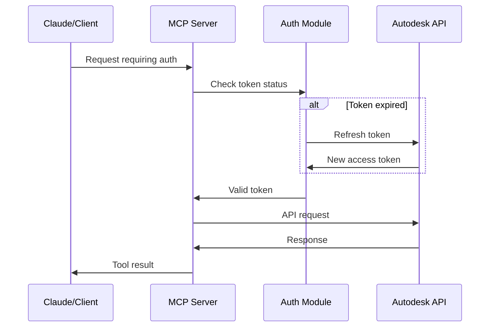
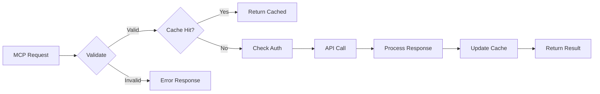

# Autodesk Build MCP Architecture

## Overview

The Autodesk Build MCP server follows a modular architecture designed for scalability, maintainability, and extensibility. This document outlines the key architectural decisions and patterns used throughout the codebase.

## Core Architecture Principles

### 1. Separation of Concerns

The server is organized into distinct layers:

```
┌─────────────────────────────────────────────────────────────┐
│                    MCP Protocol Layer                       │
│              (Handles MCP communication)                    │
├─────────────────────────────────────────────────────────────┤
│                     Tool Router                             │
│           (Routes requests to tool handlers)                │
├─────────────────────────────────────────────────────────────┤
│                   Tool Handlers                             │
│        (Individual handlers for each feature)               │
├─────────────────────────────────────────────────────────────┤
│                  Service Layer                              │
│    (Business logic and Autodesk API interaction)           │
├─────────────────────────────────────────────────────────────┤
│                Authentication Layer                         │
│         (OAuth2 flow and token management)                  │
├─────────────────────────────────────────────────────────────┤
│                   Data Layer                                │
│        (Caching, persistence, and utilities)                │
└─────────────────────────────────────────────────────────────┘
```

### 2. Modular Tool System

Each Autodesk Build feature is implemented as a separate tool module:

```javascript
// Tool module structure
export default {
  definition: {
    name: 'tool_name',
    description: 'Tool description',
    inputSchema: { ... },
  },
  handler: async (params, context) => {
    // Implementation
  }
};
```

### 3. Authentication Architecture

#### OAuth2 Flow



#### Token Storage

- Access tokens: In-memory with TTL
- Refresh tokens: Secure system keychain (when available)
- Fallback: Encrypted file storage

### 4. Error Handling Strategy

```javascript
// Centralized error handling
class AutodeskError extends Error {
  constructor(message, code, details) {
    super(message);
    this.code = code;
    this.details = details;
  }
}

// Error categories
- AuthenticationError: OAuth2 and permission issues
- ValidationError: Input validation failures
- APIError: Autodesk API errors
- NetworkError: Connection issues
- RateLimitError: Rate limiting
```

### 5. Caching Architecture

#### Cache Layers

1. **Memory Cache**: Fast access for frequently used data
2. **Disk Cache**: Persistent cache for larger datasets
3. **Request Deduplication**: Prevents duplicate API calls

```javascript
// Cache key structure
const cacheKey = `${resource}:${projectId}:${params}`;

// Cache invalidation strategies
- TTL-based expiration
- Event-based invalidation (webhooks)
- Manual invalidation via tools
```

### 6. Rate Limiting and Retry Logic

```javascript
// Exponential backoff with jitter
const delay = Math.min(
  baseDelay * Math.pow(2, attempt) + Math.random() * 1000,
  maxDelay
);

// Rate limit tracking
const rateLimiter = {
  tokens: 100,
  refillRate: 10,
  window: 60000 // 1 minute
};
```

## Data Flow

### Tool Execution Flow

1. **Request Reception**: MCP server receives tool request
2. **Validation**: Input parameters are validated against schema
3. **Authentication**: Token validity is checked
4. **Cache Check**: Look for cached response
5. **API Call**: Make request to Autodesk API
6. **Response Processing**: Transform API response
7. **Cache Update**: Store response in cache
8. **Result Return**: Send formatted result to client



## Security Architecture

### 1. Authentication Security

- OAuth2 with PKCE for enhanced security
- Secure token storage using system keychain
- Automatic token rotation
- Scope-based permissions

### 2. Data Security

- All API communications over HTTPS
- Input sanitization and validation
- No sensitive data in logs
- Encrypted cache storage for sensitive data

### 3. Access Control

```javascript
// Permission checking
const checkPermission = async (token, resource, action) => {
  const permissions = await getTokenPermissions(token);
  return permissions.includes(`${resource}:${action}`);
};
```

## Performance Optimizations

### 1. Connection Pooling

```javascript
// HTTP agent with keep-alive
const agent = new https.Agent({
  keepAlive: true,
  maxSockets: 10,
  maxFreeSockets: 5,
  timeout: 60000
});
```

### 2. Batch Operations

```javascript
// Batch API requests
const batchRequest = async (items, batchSize = 50) => {
  const batches = chunk(items, batchSize);
  const results = await Promise.all(
    batches.map(batch => processBatch(batch))
  );
  return flatten(results);
};
```

### 3. Streaming Responses

For large datasets, responses are streamed:

```javascript
// Stream large photo collections
const streamPhotos = async function* (projectId, filters) {
  let pageToken = null;
  do {
    const page = await getPhotoPage(projectId, filters, pageToken);
    yield* page.items;
    pageToken = page.nextPageToken;
  } while (pageToken);
};
```

## Extensibility

### Adding New Tools

1. Create new tool module in `src/tools/`
2. Define tool schema and handler
3. Register in tool index
4. Add tests

### Plugin Architecture

```javascript
// Plugin interface
interface Plugin {
  name: string;
  version: string;
  init(server: MCPServer): void;
  tools?: Tool[];
  middleware?: Middleware[];
}
```

## Monitoring and Observability

### 1. Logging Strategy

```javascript
// Structured logging
logger.info('API request', {
  tool: 'list_issues',
  projectId: 'abc123',
  duration: 234,
  cached: false
});
```

### 2. Metrics Collection

- Request count by tool
- Response times
- Cache hit rates
- Error rates by type
- API quota usage

### 3. Health Checks

```javascript
// Health check endpoint
const healthCheck = async () => ({
  status: 'healthy',
  version: packageInfo.version,
  uptime: process.uptime(),
  memory: process.memoryUsage(),
  auth: await checkAuthHealth(),
  api: await checkAPIHealth()
});
```

## Deployment Architecture

### 1. Container Support

```dockerfile
# Multi-stage build
FROM node:18-alpine AS builder
WORKDIR /app
COPY package*.json ./
RUN npm ci --only=production

FROM node:18-alpine
WORKDIR /app
COPY --from=builder /app/node_modules ./node_modules
COPY . .
EXPOSE 3000
CMD ["node", "src/index.js"]
```

### 2. Scaling Considerations

- Stateless design for horizontal scaling
- External cache (Redis) for shared state
- Load balancer friendly
- Graceful shutdown handling

## Future Architectural Considerations

### 1. GraphQL Support

Potential migration to GraphQL for more efficient data fetching:

```graphql
type Query {
  project(id: ID!): Project
  issues(projectId: ID!, filters: IssueFilters): IssueConnection
}

type Mutation {
  createIssue(input: CreateIssueInput!): Issue
  updateIssue(id: ID!, input: UpdateIssueInput!): Issue
}
```

### 2. Event-Driven Architecture

Webhook processing for real-time updates:

```javascript
// Event processor
const processWebhook = async (event) => {
  await eventBus.publish(event.type, event.data);
  await updateCache(event);
  await notifyClients(event);
};
```

### 3. Multi-tenant Support

Isolation strategies for supporting multiple organizations:

- Separate authentication contexts
- Data isolation
- Rate limit segregation
- Audit logging per tenant

## Conclusion

This architecture provides a solid foundation for building a reliable, scalable, and maintainable MCP server for Autodesk Build. The modular design allows for easy extension and modification as requirements evolve.