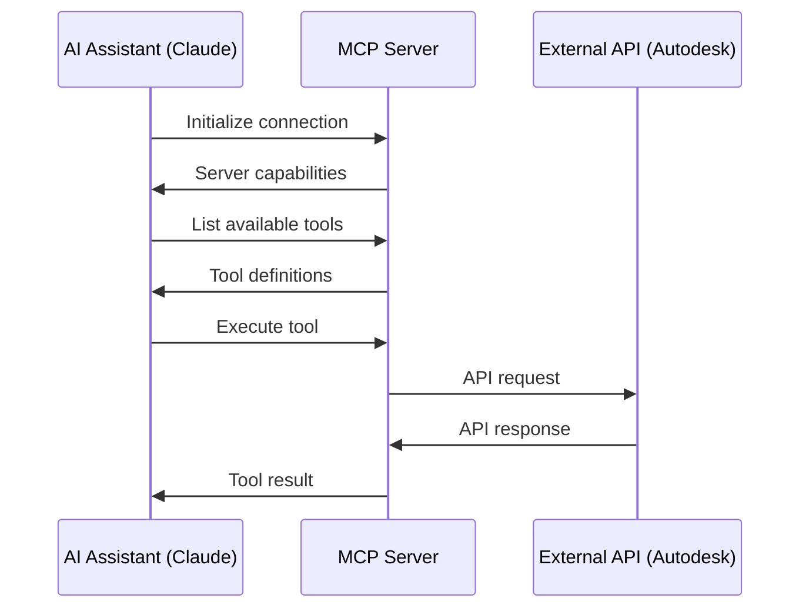

# MCP Protocol Implementation Guide

## Overview

This document describes how the Autodesk Build MCP server implements the Model Context Protocol (MCP). It covers the protocol specifications, message formats, and implementation details specific to our server.

## MCP Protocol Basics

### What is MCP?

The Model Context Protocol (MCP) is a standardized protocol for communication between AI assistants and external tools/services. It enables:

- **Tool Discovery**: AI can discover available tools and their capabilities
- **Type Safety**: Strongly typed inputs and outputs
- **Error Handling**: Standardized error responses
- **Streaming**: Support for streaming responses
- **Context Sharing**: Sharing context between tools

### Protocol Flow



## Message Format

### JSON-RPC 2.0

MCP uses JSON-RPC 2.0 for message formatting:

```json
// Request
{
  "jsonrpc": "2.0",
  "id": "unique-request-id",
  "method": "tools/execute",
  "params": {
    "name": "list_issues",
    "arguments": {
      "projectId": "abc123",
      "status": "open"
    }
  }
}

// Response
{
  "jsonrpc": "2.0",
  "id": "unique-request-id",
  "result": {
    "issues": [
      {
        "id": "issue-1",
        "title": "Concrete crack",
        "status": "open"
      }
    ]
  }
}
```

### Error Responses

```json
{
  "jsonrpc": "2.0",
  "id": "unique-request-id",
  "error": {
    "code": -32602,
    "message": "Invalid params",
    "data": {
      "field": "projectId",
      "reason": "Project not found"
    }
  }
}
```

## Server Implementation

### 1. Server Initialization

```javascript
// src/index.js
import { MCPServer } from '@modelcontextprotocol/sdk';

const server = new MCPServer({
  name: 'autodesk-build',
  version: '1.0.0',
  capabilities: {
    tools: true,
    resources: false,
    prompts: false,
    sampling: false
  }
});

// Initialize authentication
await initializeAuth();

// Register tools
registerTools(server);

// Start server
server.start();
```

### 2. Tool Registration

```javascript
// src/tools/registry.js
export function registerTools(server) {
  // Register each tool
  tools.forEach(tool => {
    server.registerTool({
      name: tool.definition.name,
      description: tool.definition.description,
      inputSchema: tool.definition.inputSchema,
      handler: createHandler(tool.handler)
    });
  });
}

function createHandler(toolHandler) {
  return async (params, context) => {
    try {
      // Validate input
      const validated = await validateInput(params);
      
      // Execute tool
      const result = await toolHandler(validated, context);
      
      // Format response
      return formatResponse(result);
    } catch (error) {
      throw formatError(error);
    }
  };
}
```

### 3. Tool Definition Schema

```javascript
// Example tool definition
export const listIssues = {
  definition: {
    name: 'list_issues',
    description: 'List construction issues with optional filters',
    inputSchema: {
      type: 'object',
      properties: {
        projectId: {
          type: 'string',
          description: 'The project ID'
        },
        status: {
          type: 'string',
          enum: ['open', 'closed', 'in_progress'],
          description: 'Filter by issue status'
        },
        assignedTo: {
          type: 'string',
          description: 'Filter by assigned user email'
        },
        limit: {
          type: 'integer',
          minimum: 1,
          maximum: 100,
          default: 20,
          description: 'Number of issues to return'
        }
      },
      required: ['projectId']
    }
  },
  handler: async (params, context) => {
    // Implementation
  }
};
```

## Protocol Messages

### 1. Initialize

```json
// Client -> Server
{
  "jsonrpc": "2.0",
  "id": 1,
  "method": "initialize",
  "params": {
    "protocolVersion": "1.0.0",
    "clientInfo": {
      "name": "Claude",
      "version": "2.0"
    }
  }
}

// Server -> Client
{
  "jsonrpc": "2.0",
  "id": 1,
  "result": {
    "protocolVersion": "1.0.0",
    "serverInfo": {
      "name": "autodesk-build",
      "version": "1.0.0"
    },
    "capabilities": {
      "tools": true
    }
  }
}
```

### 2. List Tools

```json
// Client -> Server
{
  "jsonrpc": "2.0",
  "id": 2,
  "method": "tools/list"
}

// Server -> Client
{
  "jsonrpc": "2.0",
  "id": 2,
  "result": {
    "tools": [
      {
        "name": "list_issues",
        "description": "List construction issues",
        "inputSchema": { ... }
      },
      {
        "name": "create_rfi",
        "description": "Create a new RFI",
        "inputSchema": { ... }
      }
    ]
  }
}
```

### 3. Execute Tool

```json
// Client -> Server
{
  "jsonrpc": "2.0",
  "id": 3,
  "method": "tools/execute",
  "params": {
    "name": "create_issue",
    "arguments": {
      "projectId": "abc123",
      "title": "Electrical panel installation",
      "description": "Panel needs to be relocated",
      "priority": "high"
    }
  }
}

// Server -> Client
{
  "jsonrpc": "2.0",
  "id": 3,
  "result": {
    "issue": {
      "id": "issue-456",
      "title": "Electrical panel installation",
      "status": "open",
      "createdAt": "2024-01-15T10:30:00Z"
    }
  }
}
```

## Advanced Features

### 1. Streaming Responses

For large datasets, MCP supports streaming:

```javascript
// Tool handler with streaming
export async function* streamPhotos(params, context) {
  const { projectId, limit = 1000 } = params;
  
  let offset = 0;
  const batchSize = 100;
  
  while (offset < limit) {
    const batch = await fetchPhotoBatch(projectId, offset, batchSize);
    
    for (const photo of batch) {
      yield {
        type: 'photo',
        data: photo
      };
    }
    
    if (batch.length < batchSize) break;
    offset += batchSize;
  }
  
  yield {
    type: 'complete',
    total: offset
  };
}
```

### 2. Context Sharing

Tools can share context between executions:

```javascript
// Setting context
context.set('currentProject', projectId);
context.set('authToken', token);

// Using context in another tool
const projectId = context.get('currentProject');
const token = context.get('authToken');
```

### 3. Progress Reporting

```javascript
// Long-running operation with progress
export async function processLargeDataset(params, context) {
  const { progress } = context;
  const items = await getItems();
  
  for (let i = 0; i < items.length; i++) {
    await processItem(items[i]);
    
    // Report progress
    progress({
      current: i + 1,
      total: items.length,
      message: `Processing item ${i + 1} of ${items.length}`
    });
  }
}
```

## Error Handling

### Standard Error Codes

```javascript
// MCP standard error codes
const ErrorCodes = {
  ParseError: -32700,
  InvalidRequest: -32600,
  MethodNotFound: -32601,
  InvalidParams: -32602,
  InternalError: -32603,
  
  // Custom error codes
  AuthenticationError: -32000,
  PermissionDenied: -32001,
  ResourceNotFound: -32002,
  RateLimitExceeded: -32003,
  ValidationError: -32004
};
```

### Error Response Format

```javascript
// Error formatter
function formatError(error) {
  if (error instanceof AuthenticationError) {
    return {
      code: ErrorCodes.AuthenticationError,
      message: 'Authentication failed',
      data: {
        reason: error.reason,
        authUrl: error.authUrl
      }
    };
  }
  
  if (error instanceof ValidationError) {
    return {
      code: ErrorCodes.ValidationError,
      message: 'Validation failed',
      data: {
        errors: error.validationErrors
      }
    };
  }
  
  // Default error
  return {
    code: ErrorCodes.InternalError,
    message: error.message || 'Internal server error',
    data: {
      stack: process.env.NODE_ENV === 'development' ? error.stack : undefined
    }
  };
}
```

## Security Considerations

### 1. Input Validation

```javascript
// Strict input validation
import { z } from 'zod';

const createIssueSchema = z.object({
  projectId: z.string().uuid(),
  title: z.string().min(1).max(200),
  description: z.string().max(5000),
  priority: z.enum(['low', 'medium', 'high']),
  assignTo: z.string().email().optional(),
  dueDate: z.string().datetime().optional()
});

function validateInput(schema, input) {
  try {
    return schema.parse(input);
  } catch (error) {
    throw new ValidationError(error.errors);
  }
}
```

### 2. Authentication Context

```javascript
// Authentication middleware
export function authMiddleware(handler) {
  return async (params, context) => {
    // Check authentication
    const auth = await getAuthentication();
    if (!auth.isValid()) {
      throw new AuthenticationError('Token expired', auth.getAuthUrl());
    }
    
    // Add auth to context
    context.auth = auth;
    
    // Execute handler
    return handler(params, context);
  };
}
```

### 3. Rate Limiting

```javascript
// Rate limiting middleware
const rateLimiter = new Map();

export function rateLimitMiddleware(handler, options = {}) {
  const { limit = 100, window = 60000 } = options;
  
  return async (params, context) => {
    const key = context.clientId || 'default';
    const now = Date.now();
    
    // Get or create rate limit entry
    let entry = rateLimiter.get(key);
    if (!entry || now - entry.start > window) {
      entry = { start: now, count: 0 };
      rateLimiter.set(key, entry);
    }
    
    // Check rate limit
    if (entry.count >= limit) {
      throw new RateLimitError(`Rate limit exceeded: ${limit} requests per ${window}ms`);
    }
    
    // Increment counter
    entry.count++;
    
    // Execute handler
    return handler(params, context);
  };
}
```

## Testing Protocol Implementation

### 1. Protocol Compliance Tests

```javascript
// Test protocol compliance
describe('MCP Protocol Compliance', () => {
  it('should respond to initialize', async () => {
    const response = await client.initialize({
      protocolVersion: '1.0.0',
      clientInfo: { name: 'test-client', version: '1.0.0' }
    });
    
    expect(response).toMatchObject({
      protocolVersion: '1.0.0',
      serverInfo: {
        name: 'autodesk-build',
        version: expect.any(String)
      },
      capabilities: {
        tools: true
      }
    });
  });
  
  it('should list available tools', async () => {
    const response = await client.listTools();
    
    expect(response.tools).toBeArray();
    expect(response.tools[0]).toMatchObject({
      name: expect.any(String),
      description: expect.any(String),
      inputSchema: expect.any(Object)
    });
  });
});
```

### 2. Tool Execution Tests

```javascript
// Test tool execution
describe('Tool Execution', () => {
  it('should execute tool with valid params', async () => {
    const result = await client.executeTool({
      name: 'list_issues',
      arguments: {
        projectId: 'test-project-123',
        status: 'open'
      }
    });
    
    expect(result).toMatchObject({
      issues: expect.any(Array)
    });
  });
  
  it('should handle invalid params', async () => {
    await expect(
      client.executeTool({
        name: 'list_issues',
        arguments: {
          // Missing required projectId
          status: 'open'
        }
      })
    ).rejects.toMatchObject({
      code: -32602,
      message: 'Invalid params'
    });
  });
});
```

## Performance Optimization

### 1. Connection Pooling

```javascript
// Reuse connections
const connectionPool = new Map();

export function getConnection(clientId) {
  if (!connectionPool.has(clientId)) {
    connectionPool.set(clientId, createConnection());
  }
  return connectionPool.get(clientId);
}
```

### 2. Response Caching

```javascript
// Cache tool responses
const responseCache = new LRUCache({
  max: 1000,
  ttl: 1000 * 60 * 5 // 5 minutes
});

export function cacheMiddleware(handler, options = {}) {
  const { ttl } = options;
  
  return async (params, context) => {
    // Generate cache key
    const key = generateCacheKey(context.tool, params);
    
    // Check cache
    const cached = responseCache.get(key);
    if (cached) {
      return cached;
    }
    
    // Execute handler
    const result = await handler(params, context);
    
    // Cache result
    responseCache.set(key, result, { ttl });
    
    return result;
  };
}
```

## Best Practices

1. **Always validate input** using schemas
2. **Handle errors gracefully** with meaningful messages
3. **Use middleware** for cross-cutting concerns
4. **Cache responses** when appropriate
5. **Stream large datasets** instead of loading all at once
6. **Document tool schemas** thoroughly
7. **Version your protocol** implementation
8. **Test protocol compliance** regularly
9. **Monitor performance** metrics
10. **Secure sensitive data** in transit and at rest

## Conclusion

This MCP implementation provides a robust, secure, and performant bridge between AI assistants and Autodesk Build. By following the protocol specifications and best practices outlined in this document, you can ensure reliable tool execution and a great user experience.